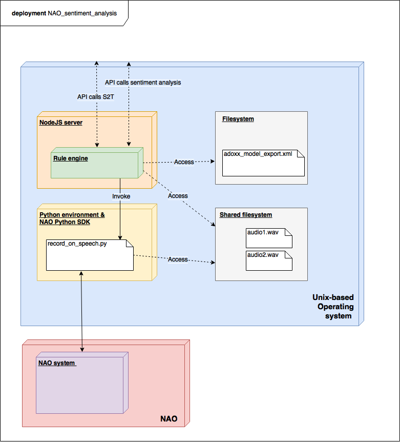

# Implementation of Scenario 1

### Table of contents

* [Implementation of scenario 1](#scenario1)
* [Technology stack of all scenarios](#technologystack)


## <a name="scenario1"></a> Scenario 1: Recording raw audio data with NAO

From our conceptualization:

> In this first scenario we want to make it possible for the NAO to start and stop recording audio. The NAO needs to be aware when someone is talking to it in order to start recording. It also has to recognize when someone is done talking to stop the recording. 

> The purpose of this use case is to gather the necessary raw data for use cases 2 and 3 so that they can provide semantically meaningful information, knowledge and actions. 

*For the full description of the first scenario please refer to [our conceptualization submission](../1_conceptualization#scenario1).*

##### Set up connectivity with the NAO

We chose to work with the red NAO, however the steps to replicate this on the blue NAO are very similar. To connect with the NAO, we have to turn it on and connect to the same WLAN as the NAO. Once this is done we can connect via the browser at `192.168.75.41`. If there are connectivity issues `arp -a` command can help out for troubleshooting.

##### SDK

For the implemation we first had to choose a NAO SDK. Only two complete SDKs are written in `C++` and `Python`. We chose `Python` mostly because it is more intuitive to read and also because we can easily run code remotely from our machines. This will be useful for the second use case, since we will be able to run commands remotely from our server on the NAO.

##### File transfer

Since we need to access the audio files which we record on the NAO, we had to figure out a way to access these files. There are lots of options however we ended up deciding for `scp` protocol. The reason for this is mostly, that in our architecture the central component is not the NAO, but another centrilized component (e.g. a smart home automation or in our case a laptop). Since we need to get the audio recordings from the NAO to our machines, `scp` is very well suited for this task. It can be remotely invoked and is secure, fast and works over a local network. See the [documentation](http://nixdoc.net/man-pages/FreeBSD/scp.1.html) for more info. 

##### Optimization of speech recognition and recording

In our original concecptualization we wrote:

> The NAO needs to be aware when someone is talking to it in order to start recording. It also has to recognize when someone is done talking to stop the recording. 

However after extensive testing and with regard to the fact that we need to build two more use cases upon the audio files that we generate in this use case, we have decided to slightly adapt the use case. Here are some of the problems we encountered:

* The NAO is a lot less responsive in a conversation than we originally thought. It's hard to pinpoint when the NAO is going to speak, and when it is going to listen. Sometime the NAO seems to be unresponsive for short periods of time. It seems while it is a cool technology, concerning conversations the NAO is not 100% reliable. While trying out different ways to mitigate this, we mostly noticed that the behaviour is quite unpredictable.

* During a conversation the NAO will make lots of noises. He will sometimes speak and very often make loud 'beep sounds'. These sounds are there to indicate when the NAO is listening and to help the flow of conversation, however they turn out extremely loud in the resulting recorded audio file. 

* Additionally, the NAO speaks itself. So his own voice will be recorded in every clip. Since our goal is ultimately to interpret and work with the audio files this also can be considered problematic.

To mitigate these problems we have decided to slighty adapt our original conceptualization. We will make the NAO listen to a set of defined keywords, and then act upon that by recording for a fixed period of time.

This allows us to focus on the main goal of intepreting and analyzing the audio files. The NAO is part of the scenario because one day it will be possible to have a personal assistant robot which can interpret the emotions of his owner, and act accordingly. The purpose of this prototype is to get as close as possible to that goal. However it seems that the hardware of the NAO is not ideally suited for this use case. If the NAO had more suitable microphones or a software which could distinguish between his own noises and other noises this could be handled better in the future.

##### Overview of the code

*The full code for this prototype of scenario 1 can be found [here](../src/testing/hello_detection.py).*

The following is the most important part of the code.

```python
def onWordRecognized(self, key, value, message):

	try:
        memory.unsubscribeToEvent("WordRecognized", "SoundDetection")
        if(len(value) > 1 and value[1] >= 0.5):    
            self.tts.say("Recording")
            import subprocess
            recorder = ALProxy("ALAudioRecorder")
            self.tts.say("Starting recorder")
            recorder.stopMicrophonesRecording()
            recorder.startMicrophonesRecording("/home/nao/test.wav", "wav", 16000, (1,0,0,0))
            time.sleep(10)
            self.tts.say("stopping recorder")
            recorder.stopMicrophonesRecording()
            self.tts.say("copying audio file")
            subprocess.call(["scp", "nao@192.168.75.41:test.wav","."])
            memory.subscribeToEvent("WordRecognized", "SoundDetection", "onWordRecognized")
        else:
            self.tts.say("I didnt Catch that")
            time.sleep(1)
            memory.subscribeToEvent("WordRecognized", "SoundDetection", "onWordRecognized")
    except:
        print("overload")
```

We defined a function `onWordRecognized` which gets triggered each time a word is recognized. All code inside that function is wrapped into a `try/catch` block, since the NAO will otherwise confuse itself and call the function too many times (see [overload]("https://gitlab.dke.univie.ac.at/st3f4n-s/ast-nao/issues/1")).

If the NAO detects a word we defined (e.g. `record`) with a confidence of over `0.5` it will start recording for 10 seconds. before saving the file and copying it to our machine via `scp`.

## <a name="technologystack"></a>Technology stack of all scenarios

*For the full description the second and third scenario please refer to [our conceptualization submission](../1_conceptualization#scenario1).*

Our system relies on the components depicted in the following deployment model.



Since this service will essentially be a home automation software it should be highly compatible, extensible and also have remote access. This is why a web service is suited for this task. That way we can seperate our application logic from the NAO by a certain degree. This makes sense, since the NAO will never leave the boundries of the wireless network anyway. The web service will make the API calls for our speech-to-text conversion and the sentiment analysis from scenario 1 and 2. The web service must also import the mood configuration model created by a user (adoxx_model_export.xml). We will rely on a NodeJS server for this task.

Now, based on the sentiment analysis and the mood configuration model, the system needs to change the environment (e.g. color of the lights). To trigger this, a rule engine will be used. The rule engine gets the interpreted sentiment analysis as an input as well as the exported mood configuration model. The rule engine has a rule for each possible element of the model. If there is a match (e.g. emotional level is above a certain threshold) the rule fires.

When a rule from the rule engine is executed it needs to trigger a change in color of the lights. To do this the rule engine can call a script which then sends out a wireless signal. A lamp will listen for signals and will change its color accordingly. Alternatively we can use the LEDs of the NAO. It will need to be discussed which option is more appropriate for scenario 2 and 3.

**Proposed software stack:**

- **Operating system:** Any common UNIX distribution will do. Either Linux, which has the advantage of being free and Open-Source or MacOS.
- **Models:** ADOxx can be used to create a metamodel as well as the actual models. It also supports XML export.
- **Engine/Web service:** NodeJS can be used. NodeJS is a JavaScript Runtime which is based on Chrome’s V8 JS engine. It is event-based, non-blocking I/O, lightweight, easily extensible and supports many libraries. 
- **Python SDK:** To access the NAO remotely from our machines we can use the Python SDK. The NodeJS server will access the Python scripts make remote calls and execute commands on the NAO.
- **XML-Import:** The web service / rule engine needs to analyze the mood configuration models and therefor they need to be imported. The already in NodeJS included library fs (FileSystem) can be used here. If needed an XML parser can additionally be used to read and interpret the model.
- **REST-API:** To make our program easily remotely accessible a REST-API will be implemented. Express is a very common way to realize REST-Services with NodeJS. It is an easy-to-use, very established library which is also quite powerful.
- **Rule engine:** As a rule engine node-rules can be used. Node-rules defines facts (JSON objects) and then executes rules based on these facts. Rules always consist of a condition and a consequence.
- **Lights:** To validate this prototype at least one actual lamp is required which can glow in different colors. Therefor puck.js can be used. It is an entirely autonomous device which has Bluetooth-support, a button and also an LED which can glow in three different colors. It can also be programmed in JavaScript which will synergise well with our JavaScript-based main program.
- **WLAN**: To communicate between our main client OS and the NAO we can hook both systems into the same WLAN, so they can communicate over the local network. The NAO Python SDK supports this.
- **Bluetooth:** Finally, to communicate wirelessly between the puck.js and the web service Bluetooth will be used as communication protocol. The puck.js supports Bluetooth natively. The system where our main system is running on needs to have a hardware Bluetooth module, and the NodeJS application can use the library node-bluetooth to control the LED on the puck.js. Like mentioned before, since the NAO has LEDs as well it might be more appropriate to use those lights, this will need to be discussed. 

